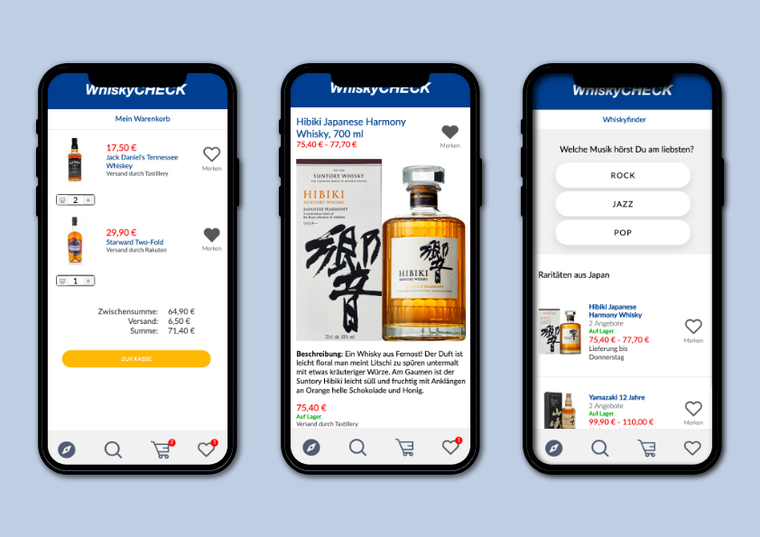

# WhiskyCHECK

WhiskyCheck is a liquor comparison app to compare a prefixed set of whisky offers.

However, if you have access to a global whisky base feel free to upload your own data from `.csv` to your own `mySQL` database.

Please mind that the app's primarily language is **German**.



## Getting Started with WhiskyCHECK

### Run npm install in the project directory /frontend.

Inside the folder, you can run:

```
npm start
```

Runs the app in the development mode.
Open http://localhost:3000 to view it in the browser.

The page will reload if you make edits.
You will also see any lint errors in the console.

```
npm test
```

Launches the test runner in the interactive watch mode.
See the section about running tests for more information.

```
npm run build
```

Builds the app for production to the build folder.
It correctly bundles React in production mode and optimizes the build for the best performance.

The build is minified and the filenames include the hashes.
Your app is ready to be deployed!

See the section about deployment for more information.

## Run composer install in the project directory /backend.

```
composer install
```

You might have to setup your own .env file, if you want to test this project on your own server and migrate the entities to a database.

## Contributing

Pull requests are welcome.

The application was build within the frame of a webdeveloper bootcamp which implies that there is many room for extensions and further development.
